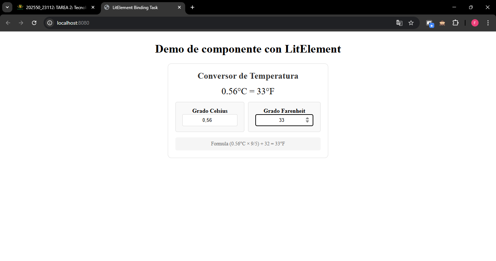
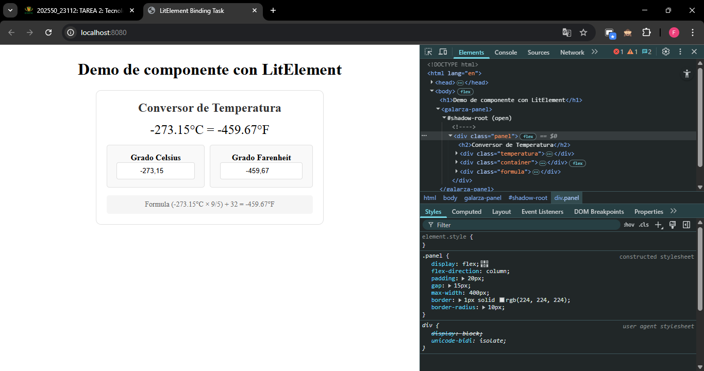

# Conversor de Temperatura - Componente LitElement
`<galarza-panel>`  
Es un componente web creado con LitElement que permite convertir temperaturas entre grados Celsius y Farenheit en tiempo real y viceversa. El usuario puede ingresar un valor en cualquiera de los dos campos, y el componente actualizara el valor correspondiente usando la formula de conversion que tambien muestra.

## Objetivo
Componente web que:
- Convierte entre Celsius y Farenheit en tiempo real
- Muestra la formula de conversion aplicada
- Diseño responsive y moderno

## Tecnologías usadas


## Explicacion Tecnica

### Propiedades (`@property`)

Se definen dos propiedades:
- `celsius`: numero que representa los grados Celsius.
- `farenheit`: numero que representa los grados Farenheit.

Estas propiedades estan declaradas en el metodo estatico `properties`, permitiendo que Lit realice actualizaciones automaticas del DOM cuando sus valores cambian.

### Renderizado (`render`)

El metodo `render()` retorna un HTML utilizando la función `html` de Lit. Se incluyen elementos como encabezados, contenedores de tarjetas, campos de entrada y una formula informativa, todo estilizado con CSS.

### Eventos (`@input`)

Cada campo de entrada escucha el evento `@input`. Al modificar el valor en un input, se llama a:
- `actualizarCelsius`: convierte de Celsius a Farenheit.
- `actualizarFarenheit`: convierte de Farenheit a Celsius.

## Instalacion y ejecucion
1. **Clonar el repositorio**
```bash
git clone https://github.com/paulosk8/lit-binding-task-2025
```
2. **Navegar al directorio del proyecto**
```bash
cd GalarzaPanel
```
3. **Instalar dependencias**
```bash
npm install
```
4. **Ejecutar el componente**
```bash
npm run serve
```
- Asegúrate de importar el componente correctamente en un archivo HTML:

  ```html
  <script type="module" src="./GalarzaPanel/src/GalarzaPanel.js"></script>
  <galarza-panel></galarza-panel>
  ```
## Capturas de pantalla del funcionamiento
Conversion de Celsius a Farenheit usando el componente.



Conversion de Farenheit a Celsius usando el componente, donde se puede evidenciar el codigo en el navegador.



## Errores comunes enfrentados y cómo se solucionaron

| Error / Mensaje                                                   | Causa                                                                 | Solución                                                                                  |
|-------------------------------------------------------------------|------------------------------------------------------------------------|--------------------------------------------------------------------------------------------|
| En .value no se asigna el valor string porque es un number         | `.value` espera un string, pero se asigna un número                   | Convertir a string: `.value=${String(this.celsius)}`                                      |
| Input no actualiza valor al escribir                              | Propiedades no enlazadas o no reactivas correctamente                 | Usar `@input="${this.función}"` y definir propiedades en `static get properties()`        |
| El panel no se ve centrado en pantalla                            | Falta de estilos de centrado                                          | Agregar `margin: auto` y definir un `width`, o usar `display: flex` en el contenedor      |
