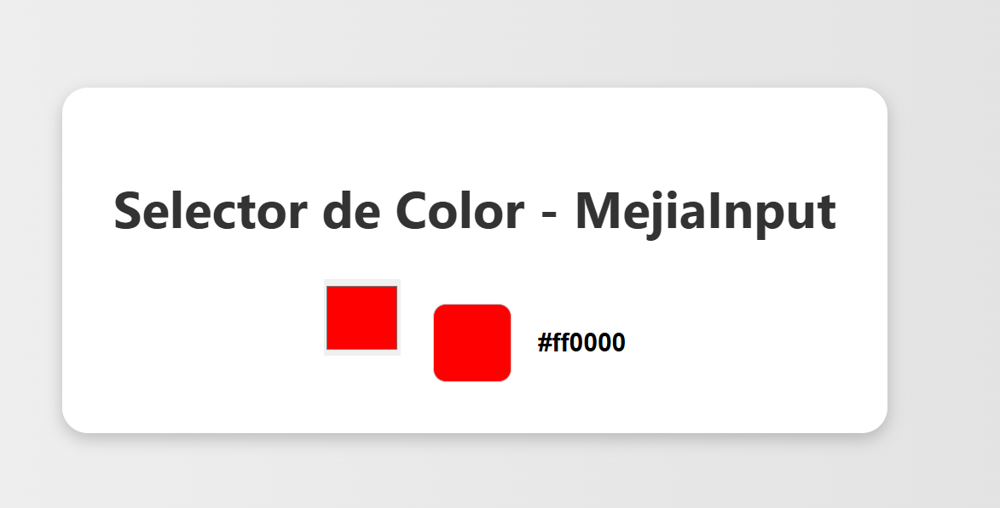
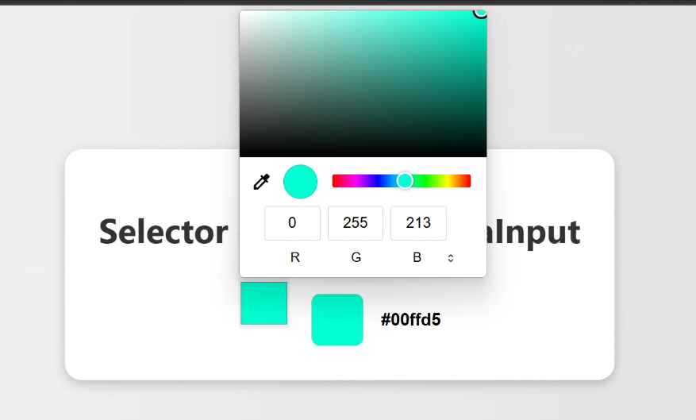

# MejiaInput – Selector de color con vista previa

##  Objetivo

El componente `MejiaInput` es un selector de color (`<input type="color">`) desarrollado con **LitElement**. Permite al usuario elegir un color desde una paleta, mostrando inmediatamente una **vista previa del color seleccionado** y su código hexadecimal. Este componente cumple con el requerimiento de crear un `<color-picker-preview>` funcional.

---

##  Explicación técnica

###  Componentes usados:
- **LitElement:** clase base para crear Web Components modernos.
- **HTML Template:** se usa la función `html` para renderizar dinámicamente el contenido.
- **Estilos CSS encapsulados:** usando la propiedad `static styles`.

###  Binding y Reactividad

- Se intentó usar el decorador `@property()` para definir la propiedad reactiva `selectedColor`, pero se presentaron errores relacionados con la compilación (shadowing de propiedades con campos de clase), por lo que se optó por usar `static get properties()`.

#### Código comentado que muestra el intento con `@property()`:

```js
// import { property } from 'lit/decorators.js';
// @property()
// selectedColor;
```
En lugar de eso, se definió la propiedad así:

```js
static get properties() {
  return {
    selectedColor: { type: String }
  };
}
```

Renderizado dinámico

La función render() actualiza el DOM automáticamente cuando cambia el valor de selectedColor.

```js
render() {
  return html`
    <input type="color" .value=${this.selectedColor} @input=${this._onColorChange} />
    <span class="preview" style="background-color: ${this.selectedColor};"></span>
    <span class="color-text">${this.selectedColor}</span>
  `;
}
```

Manejo de eventos

El evento @input del selector de color actualiza el estado del componente:

```js
_onColorChange(event) {
  this.selectedColor = event.target.value;
}
```

# Instalación y ejecución

## 1. Clona el repositorio del profesor:

```js
git clone https://github.com/paulosk8/lit-binding-task-2025.git
cd lit-binding-task-2025
```

##  2. Crea una nueva rama con tu nombre:

```js
git checkout -b feature/anthony-mejia
```

## 3. Instala las dependencias:

```js
npm install
```

## 4. Ejecuta el proyecto:

```js
npm run start
```

Abre el navegador: Se abrirá automáticamente en http://localhost:8080.

# Capturas de pantalla

## Componente Color Preview en ejecución



## Seleccion de cualquier color mediante el componente  




## Error	                                          Solucion 

`require is not defined` al ejecutar Webpack: Nos debemos asegurar de que nuestro archivo `webpack.config.js` usa `type: "module"` en `package.json` o cambia `require` por `import`.
	
`@property()` no actualiza correctamente `selectedColor`: El compilador sobrescribe las propiedades definidas con `@property` debido al uso de campos de clase. Se solucionó usando `static get properties()`.

`Module not found: ./src/MejiaInput.js`: Verifica que el archivo esté en la ruta correcta y con el nombre exacto.

Pantalla en blanco: Asegúrate de que el componente esté correctamente importado en el `index.html` con `<script type="module" src="./src/MejiaInput.js"></script>`. También verifica que `customElements.define(...)` esté correctamente definido.


# Autor

Anthony Geovanny Mejía Gaibor


