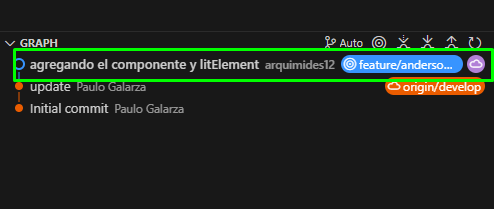
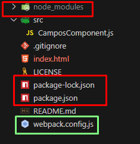
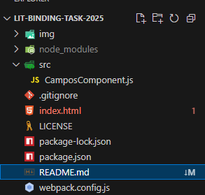

# Tarea 1 U2  LitElement - Data Binding | Editor de Perfil
Busca implementar un componente web personalizado con **LitElement**, aplicando el concepto de **Data binding** entre propiedades del componente y el DOM.

# Objetivo 
Aplicar el modelo de programación reactiva con LitElement, creando un formulario editable y reactivo que muestre en tiempo real los cambios hechos por el usuario.

# Paso 1 
 Clonar el repositorio del ingeniero (o hacer Fork primero si es tu repositorio personal)
git clone https://github.com/arquimides12/lit-binding-task-2025.git
cd lit-binding-task-2025 

# Paso 2 
Creamos una rama: git checkout -b anderson-campos

# Paso 3: Instalación de dependencias y LitElement 
Ya que usamos LitElement con Webpack, se instalan las dependencias 
npm install
npm init -y
npm install lit
npm install --save-dev webpack webpack-cli webpack-dev-server html-webpack-plugin
npm run serve

En la imagen podemos ver que se actualizo las carpetas con color rojo 

# Paso 4 : Estructura del proyecto 

 

