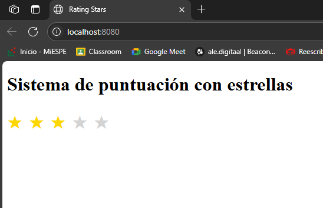

=====================================================
Torres Rating Stars - Componente Web Personalizado
=====================================================

Proyecto desarrollado por Jennifer Torres para la asignatura
Desarrollo de Software para la Integración 202550.

-----------------------------------------------------
 Mi Proyecto Aquí:  

  


-----------------------------------------------------
1. INTRODUCCIÓN
-----------------------------------------------------
Este proyecto desarrolla un componente web personalizado llamado <torres-rating-stars>
usando la librería LitElement. El componente permite a los usuarios seleccionar una calificación
mediante estrellas, mostrando una interfaz dinámica, accesible y moderna.

Se abordan conceptos clave como Shadow DOM para encapsulación,
propiedades reactivas para actualización automática de la UI,
y eventos personalizados para comunicar cambios al exterior.

-----------------------------------------------------
2. OBJETIVOS
-----------------------------------------------------
- Crear un componente LitElement reutilizable y funcional.
- Implementar propiedades reactivas para manejar el estado (rating).
- Garantizar accesibilidad con roles ARIA y soporte para teclado.
- Documentar todo el proceso, desde decisiones técnicas hasta errores y soluciones.

-----------------------------------------------------
3. DESCRIPCIÓN DEL COMPONENTE
-----------------------------------------------------
El componente TorresRatingStars incluye:

- Propiedad reactiva `rating` para almacenar la calificación seleccionada.
- Renderizado dinámico que muestra cinco estrellas, resaltando según el rating.
- Métodos para actualizar la puntuación al hacer clic en una estrella.
- Emisión de eventos personalizados para notificar cambios de rating.
- Uso de Shadow DOM para encapsular estilos y estructura, evitando conflictos.

-----------------------------------------------------
4. EXPLICACIÓN DEL CÓDIGO
------------------------------------------------------
A continuación lo más importante de `src/TorresRatingStars.js`:

```js
import { LitElement, html, css } from 'lit';
import { property } from 'lit/decorators.js';

export class TorresRatingStars extends LitElement {
  // 1. Definición de estilos encapsulados
  static styles = css`
    .star {
      font-size: 2.5rem;
      cursor: pointer;
      color: #ccc;
      transition: color 0.3s ease;
    }
    .star.selected {
      color: gold;
    }
  `;

  // 2. Propiedad reactiva que controla cuántas estrellas están seleccionadas
  @property({ type: Number }) rating = 0;

  // 3. Método para actualizar el rating y disparar un evento
  setRating(index) {
    this.rating = index + 1;
    this.dispatchEvent(new CustomEvent('rating-changed', {
      detail: { rating: this.rating },
      bubbles: true,
      composed: true
    }));
  }

  // 4. Renderizado dinámico con accesibilidad: clic y teclado
  render() {
    return html`
      ${[...Array(5)].map(
        (_, i) => html`
          <span
            class="star ${i < this.rating ? 'selected' : ''}"
            @click=${() => this.setRating(i)}
            @keydown=${e => e.key === 'Enter' && this.setRating(i)}
            role="button"
            aria-label="Puntuar ${i + 1} estrellas"
            tabindex="0"
          >★</span>
        `
      )}
    `;
  }
}
```
-----------------------------------------------------
5. DECISIONES TÉCNICAS
-----------------------------------------------------
- Uso de LitElement por su simplicidad y eficiencia en componentes Web.
- Configuración de Babel para soportar decoradores (plugins necesarios).
- Modularización con ES Modules para mejor mantenimiento.
- Webpack configurado para desarrollo y build, con source maps para debugging.
- Añadido soporte para accesibilidad con roles y eventos de teclado.

-----------------------------------------------------
5. ERRORES Y SOLUCIONES COMUNES
-----------------------------------------------------
- Error de Babel sobre decoradores: fue necesario añadir el plugin
  @babel/plugin-proposal-decorators en el archivo de configuración Babel.
- Error de importación sin extensión: se corrigió añadiendo ".js" en los imports.
- Problema "Failed to resolve module specifier 'lit'": corregido usando import
  desde node_modules o configurando el servidor para servir módulos correctamente.

-----------------------------------------------------
6. INSTRUCCIONES PARA EJECUTAR
-----------------------------------------------------
1. Clonar el repositorio y acceder a la carpeta del proyecto.
2. Ejecutar `npm install` para instalar dependencias.
3. Ejecutar `npm run start` para iniciar el servidor de desarrollo con Webpack.
4. Abrir en navegador http://localhost:8080 para ver la demo con el componente.
5. Modificar el código en `src/TorresRatingStars.js` y ver los cambios en tiempo real.

-----------------------------------------------------
7. BUENAS PRÁCTICAS APLICADAS
-----------------------------------------------------
- Uso de Shadow DOM para encapsular estilos.
- Propiedades reactivas para actualización eficiente.
- Eventos personalizados para comunicación entre componentes.
- Código modular y legible, con comentarios explicativos.
- Uso de Babel y Webpack para compatibilidad y optimización.

-----------------------------------------------------
8. PRÓXIMAS MEJORAS
-----------------------------------------------------
- Añadir soporte para medios táctiles (touch events).
- Permitir calificaciones con medias estrellas.
- Integrar pruebas unitarias y de integración.
- Mejorar la personalización del componente (colores, tamaños).

-----------------------------------------------------
9. PREGUNTAS FRECUENTES
-----------------------------------------------------
- ¿Por qué usar LitElement?  
  Porque facilita la creación de componentes web reactivos con menos código.

- ¿Qué es Shadow DOM?  
  Es una técnica para encapsular estilos y estructura, evitando que el CSS externo
  afecte al componente.

- ¿Cómo puedo escuchar el cambio de rating?  
  El componente emite un evento personalizado 'rating-changed' con el nuevo valor.

-----------------------------------------------------
10. REFERENCIAS
-----------------------------------------------------
- Documentación oficial LitElement: https://lit.dev/
- Babel Plugin Proposal Decorators: https://babeljs.io/docs/en/babel-plugin-proposal-decorators
- Webpack: https://webpack.js.org/
- MDN Web Docs: https://developer.mozilla.org/

-----------------------------------------------------
Fin del documento
-----------------------------------------------------
