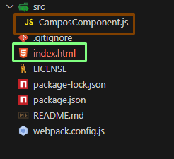
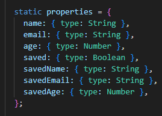
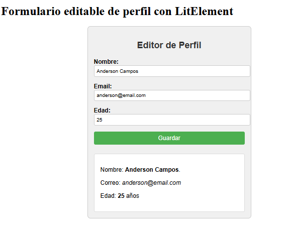
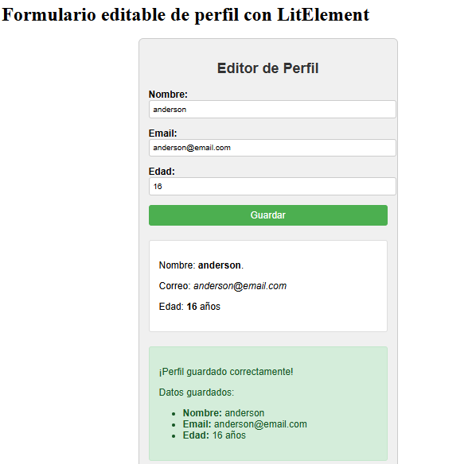
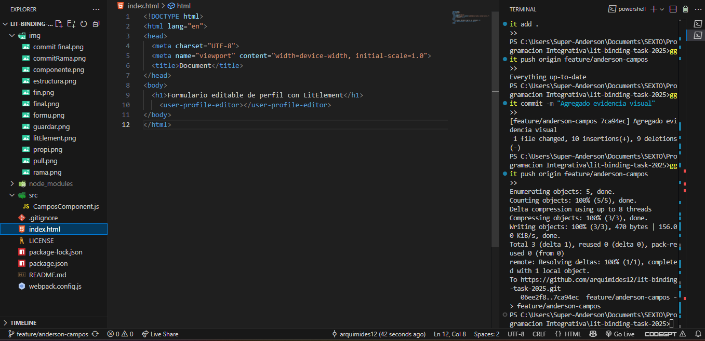

# Tarea 1 U2  LitElement - Data Binding | Editor de Perfil
Busca implementar un componente web personalizado con **LitElement**, aplicando el concepto de **Data binding** entre propiedades del componente y el DOM.

# Objetivo 
Aplicar el modelo de programación reactiva con LitElement, creando un formulario editable y reactivo que muestre en tiempo real los cambios hechos por el usuario.

# Paso 1 
 Clonar el repositorio del ingeniero (o hacer Fork primero si es tu repositorio personal)
git clone https://github.com/arquimides12/lit-binding-task-2025.git
cd lit-binding-task-2025 

# Paso 2 
Creamos una rama: git checkout -b anderson-campos

# Paso 3: Instalación de dependencias y LitElement 
Ya que usamos LitElement con Webpack, se instalan las dependencias 
npm install
npm init -y
npm install lit
npm install --save-dev webpack webpack-cli webpack-dev-server html-webpack-plugin
npm run serve

En la imagen podemos ver que se actualizo las carpetas con color rojo 

# Paso 4 : Estructura del proyecto 

 # Paso 5: Creación del componente 
El archivo src/CamposComponent.js tiene este nombre en particular por las indicaciones dadas por el ingeniero este contiene el componente <user-profile-editor> hecho con LitElement. Este permite editar nombre, email y edad, y muestra los datos actualizados en tiempo real. 

# Explicación técnica del binding 
Se usa @property (implícito en static properties) para declarar atributos reactivamente: 

 
 El método render() usa interpolación de valores y escucha eventos con @input y binding de valor con .value.
 
 <input type="text" .value=${this.name} @input=${e => this.name = e.target.value}> 
 
 El botón guarda los datos actuales y los muestra dentro de un bloque condicional:
 
 <button @click=${this.guardarPerfil}>Guardar</button>

 # ¿Qué hace el componente? 
 
Muestra inputs para Nombre, Correo y Edad
Actualiza los valores al escribir (data binding)
Muestra los valores en la parte inferior en vivo

Al presionar "Guardar", aparece el mensaje: de los datos que apareceran por cinco segundo 

# Commit final
Ahora realizamos el ultimo commit en nuestra rama para que se actualize el deber 

# Crear Pull Request 

Ir a tu fork en GitHub
Presionar "Compare & pull request"
Título del PR:
PR: Anderson Campos
Descripción: 
Entrega de la tarea 1 

# Conclusiones
- Hubo una variedad de dificultades cuando se guardaba el mensaje salia vacio para eso se agrego  variables savedName, savedEmail y savedAge.
- Cuando el componente no se mostraba en el index.html se cargó correctamente el bundle.js desde Webpack.
- Mi index como esta No necesitas incluir <script src="src/CamposComponent.js">, Webpack lo empaqueta solo.
