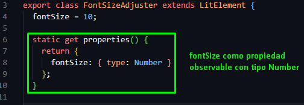
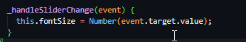
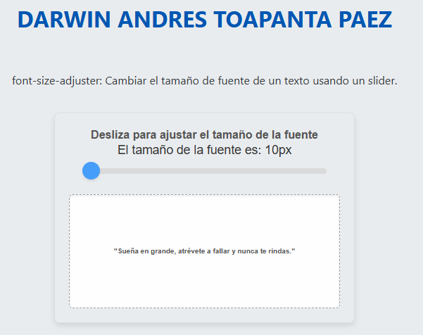
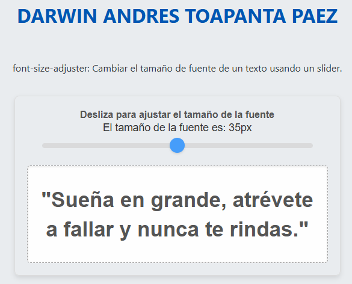

# lit-binding-task-2025

Tarea académica para implementar data binding usando LitElemen
Nombre de la tarea

# Tarea Académica: Implementar Data Binding en un Componente usando LitElement

## Asignatura: Desarrollo Web Avanzado

**Docente:** Ing. Paulo Galarza.
**Periodo:** 2025-1

---

## Objetivo de la tarea

Desarrollar un componente web utilizando LitElement que implemente correctamente el **data binding** (vinculación de datos) unidireccional y/o bidireccional. Esta tarea pondrá en práctica conceptos clave como el uso de decoradores `@property`, la reactividad del DOM, y el ciclo de vida de un componente.

---

# Font Size Adjuster

**Autor:** Darwin Andrés Toapanta Páez  
**Componente:** `<font-size-adjuster>`  
**Objetivo:** Permitir al usuario ajustar dinámicamente el tamaño de fuente de un texto motivacional usando un control tipo *slider*.

---

## 🧠 Explicación Técnica del Binding

Este componente utiliza **LitElement** y aprovecha varias técnicas de binding:

- 🔧 **Propiedades Reactivas:**  
  Se declara la propiedad `fontSize` como un número reactivo usando `static get properties()`.  
  Esto permite que los cambios en su valor actualicen automáticamente el DOM.

- 🧪 **Renderizado Dinámico (`render`)**:  
  Se vincula `fontSize` dentro del HTML usando interpolación:  
  ```html
  <p style="font-size: ${this.fontSize}px;">

- 🎯 **Eventos (@input):**
   El slider captura el evento input y llama a la función _handleSliderChange, la cual actualiza la propiedad fontSize en tiempo real:
   ```java
   @input=${this._handleSliderChange}

## ⚙️ Pasos de Instalación y Ejecución
Clona este repositorio (o tu fork) en tu equipo:
 ```bash
git clone https://github.com/DarwinToapanta01/lit-binding-task-2025.git
cd lit-binding-task-2025
 ```
Instala las dependencias del proyecto:
```bash
npm install
```
## 🛠️ Implementación Técnica
- 📌 1. Data Binding con LitElement
El componente <font-size-adjuster> implementa correctamente el data binding utilizando:

Propiedades reactivas:


DOM reactivo:


Manejo de eventos:




## 🏃‍♀️ Ejecución del proyecto 
Ejecuta el proyecto localmente:
```bash
npm run serve
```
Abre tu navegador por lo general con el siguiente link:
```bash
http://localhost:8080
```
## 📸 Capturas de Pantalla


