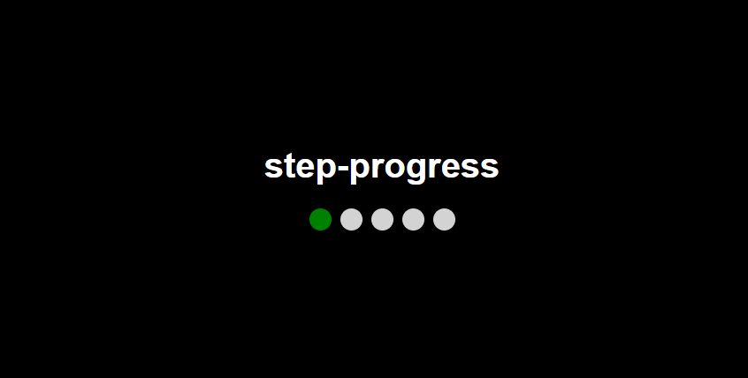
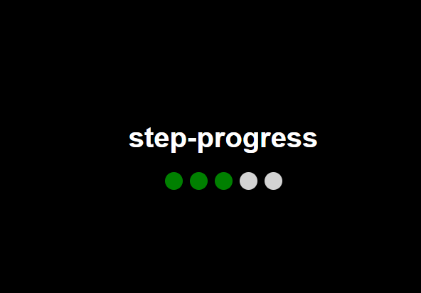

# Step Progress – Web Component con LitElement

## Descripción del proyecto
`<step-progress>` es un Web Component que muestra un indicador de pasos con botones para avanzar y retroceder. Se implementa con LitElement, aplicando data binding entre propiedades y el DOM.

## Objetivos de la tarea
- Implementar correctamente la reactividad de datos con `static properties` y `render()`.
- Comprender cómo interactúan las propiedades con el DOM en tiempo real.
- Aplicar buenas prácticas de versionamiento con GitHub Flow.
- Documentar el proyecto de forma clara y técnica.
- Justificar decisiones de implementación y errores corregidos.

## Instalación y ejecución

### 1. Clonar el repositorio
Ejecuta en tu terminal:

```bash
git clone https://github.com/AndresPantoja004/lit-binding-task-2025.git
cd lit-binding-task-2025
```

### 2. Instalar dependencias
```bash
npm install
```

### 3. Iniciar el servidor local
```bash
npx lite-server
```

Esto abrirá `index.html` en el navegador y cargará el componente.

## Uso del componente

Para utilizar `<step-progress>`, agrégalo a tu HTML:

```html
<step-progress></step-progress>
```

El componente muestra 5 pasos por defecto y permite avanzar y retroceder con botones. También puedes personalizar la cantidad de pasos con el atributo `total`:

```html
<step-progress total="7"></step-progress>
```

## Explicación técnica

### Binding con `static properties`

El estado del componente se gestiona con propiedades reactivas declaradas en `static properties`:

```js
static properties = {
  current: { type: Number },
  total: { type: Number }
};
```

Cada vez que `current` cambia, LitElement actualiza el DOM automáticamente, mostrando el nuevo estado.

### Renderizado reactivo

El método `render()` actualiza dinámicamente los pasos en el DOM:

```js
render() {
  return html`
    <div class="progress">
      ${Array.from({ length: this.total }, (_, i) => html`
        <div class="step ${i < this.current ? 'active' : ''}"></div>
      `)}
    </div>
  `;
}
```

## Errores comunes y soluciones

### 🚨 Error: "Failed to resolve module specifier 'lit'"
🔹 **Solución**: Asegúrate de que `lit` está instalado correctamente con:

```bash
npm install lit
```

Y usa la importación adecuada sin rutas relativas:

```js
import { LitElement, html, css } from 'lit';
```

### 🚨 Error: "Nothing to commit, working tree clean"
🔹 **Solución**: Si `git commit` no detecta cambios, asegúrate de modificar los archivos antes de agregarlos con:

```bash
git add .
```

### 🚨 Error: "Uncaught TypeError: Cannot read properties of undefined"
🔹 **Solución**: Verifica que las propiedades tengan valores iniciales en el constructor:

```js
constructor() {
  super();
  this.current = 1;
  this.total = 5;
}
```

## Capturas de pantalla

Guarda tus imágenes en la carpeta `docs/` con estos nombres:

- `docs/component-default.png` → Componente con 5 pasos por defecto.
- `docs/component-custom-steps.png` → Componente con un número personalizado de pasos (`total="7"`).
- `docs/button-navigation.png` → Botones funcionando al avanzar y retroceder.
- `docs/error-example.png` → Algún error encontrado y solución aplicada.
- `docs/github-flow.png` → Flujo de trabajo con GitHub mostrando commits y pull request.

Puedes agregar las imágenes en el README con:

```markdown


```

## Versionamiento con GitHub Flow

El proyecto sigue GitHub Flow:

- Se crea un fork del repositorio base.
- Se clona el fork con `git clone`.
- Se trabaja en la rama `feature/step-progress` con commits descriptivos.
- Se hace un Pull Request hacia `develop` para revisión.

