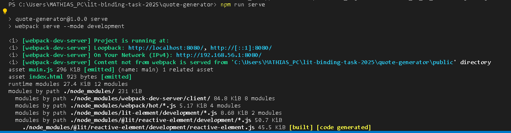
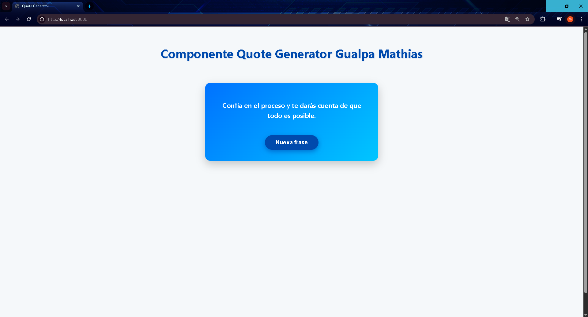
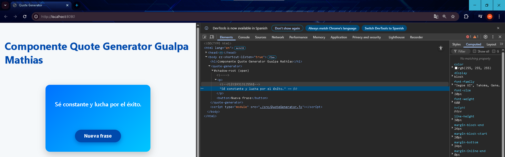
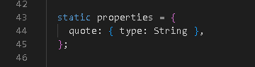
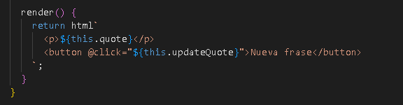
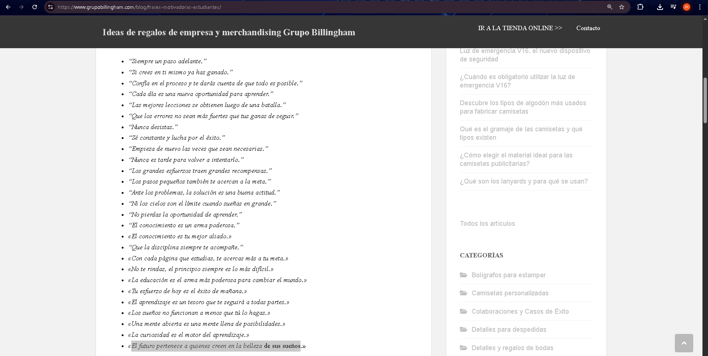

# Quote Generator

## Nombre del componente y objetivo

**Componente:** `<quote-generator>`

**Objetivo:**  
Crear un componente web personalizado utilizando LitElement que muestre frases motivacionales aleatorias. El componente implementa data binding para actualizar dinámicamente la cita mostrada al usuario cuando se presiona un botón.

---

## Explicación técnica del binding usado

El componente extiende `LitElement` y utiliza:

- **@property (`static properties`)** para declarar la propiedad reactiva `quote` de tipo String.  
  Esto permite que cuando se actualice `quote`, el componente se re-renderice automáticamente en el DOM.

- **render()** devuelve una plantilla HTML que muestra la cita actual dentro de un párrafo y un botón que dispara un evento.

- **Eventos:**  
  El botón tiene un listener de evento `@click` que llama al método `updateQuote()`, el cual cambia el valor de `quote` con una frase aleatoria tomada de un arreglo interno.

Gracias a esta estructura, el DOM es reactivo y siempre refleja el valor actual de la propiedad `quote`.

---

## Pasos de instalación y ejecución

1. **Inicializar el proyecto npm**  
   Para crear el archivo `package.json` con la configuración básica por defecto se ocupa el siguiente comando
   npm init -y

2. **Instalar LitElement**
    Para poder instalar la librería LitElement, necesaria para crear el componente web se ocuapa el siguiente comando:
    npm install lit-element

3. **Instalar herramientas de desarrollo para empaquetado con Webpack**
    Para empaquetar y servir el proyecto localmente se deben instalar las siguientes dependencias de desarrollo y se ocuapa el siguiente comando:
    npm install --save-dev webpack webpack-cli webpack-dev-server html-webpack-plugin

4. **Para ejecutar el proyecto en modo desarrollo y servirlo localmente**
    Para levantar un servidor local y probar el componente en el navegador se usa el siguiente comando:
    npm run serve

## Capturas de pantalla del funcionamiento
  Primero, se levanta el servidor local con el comando `npm run serve`.  
    

  Luego, al abrir la URL en el navegador, se muestra la interfaz del componente con una frase aleatoria y el botón para generar nuevas frases.  
    

  Al presionar nosotros el boton de Nueva Frase se va ir cambiando la frase de manera aleatoria 
    

  Declaración de la propiedad quote como reactiva LitElement detecta los cambios en esta propiedad y actualiza automáticamente el DOM cuando su valor cambia.
    

  Método render() que genera el contenido HTML del componente. El valor de quote se inyecta dinámicamente y cambia cada vez que se actualiza la propiedad, gracias al data binding.
   

  Para finalizar, las frases motivacionales utilizadas en el componente fueron tomadas de la siguiente página web:

  📌[Grupo Billingham - Frases motivadoras para estudiantes](https://www.grupobillingham.com/blog/frases-motivadoras-estudiantes/)

  

## Errores comunes enfrentados y cómo se solucionaron

| Error encontrado | Solución aplicada |
|------------------|--------------------|
| No se actualizaba la cita al hacer clic | Se corrigió el binding usando `@click=\${this.updateQuote}` |
| Error al importar LitElement | Se configuró Webpack correctamente para soportar módulos ES |
| Se repetían frases muy seguido | Se identificó como limitación del generador aleatorio; se propone mejora futura |