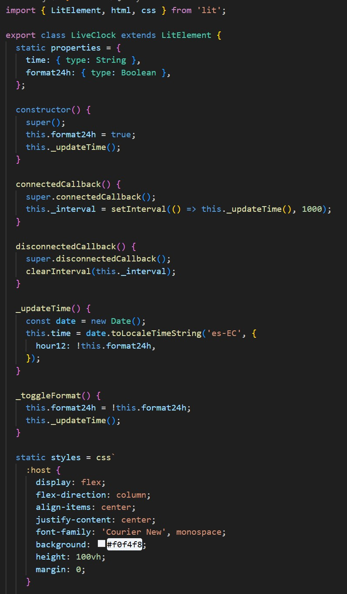
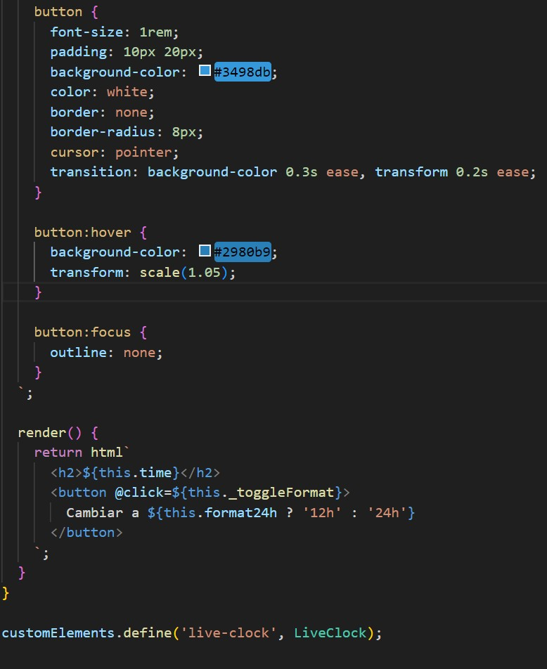
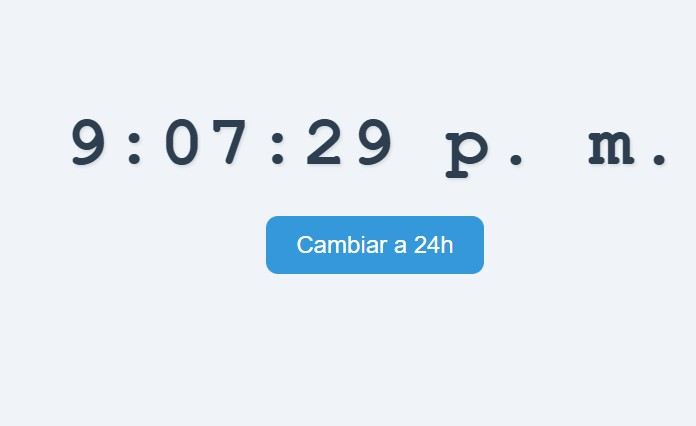

# 📘 Informe técnico: Componente `<live-clock>` usando LitElement

### Estudiante: Giovanny Francisco Durán Sánchez  
### Asignatura: Integrativa Componentes Web  
### Docente: Ing. Paulo Galarza 
### Rama: `feature/live-clock_Duran_Giovanny`

---

## 🧩 Introducción

El presente documento describe el desarrollo e implementación de un componente Web personalizado `<live-clock>` utilizando el framework **LitElement**, como parte del aprendizaje de data binding y componentes reusables. El componente fue desarrollado aplicando las buenas prácticas de estructuración, reactividad y manejo de eventos, integrando además control de versiones con GitHub Flow y documentación técnica adecuada para su revisión.

---

## 🎯 Objetivos

### Objetivo general
Implementar un componente Web que muestre un reloj en tiempo real con opción de cambio de formato (24h / 12h), utilizando LitElement y aplicando data binding.

### Objetivos específicos
- Aplicar el decorador `@property` para gestionar propiedades reactivas.
- Actualizar dinámicamente el DOM usando el método `render()`.
- Gestionar eventos para alternar el formato del reloj.
- Aplicar GitHub Flow como estrategia de control de versiones.
- Documentar todo el desarrollo mediante capturas y explicación técnica.

---

## ⚙️ Desarrollo técnico

El componente fue desarrollado en el archivo `src/LiveClock.js`, y su punto de entrada fue configurado mediante `webpack.config.js`. El uso de `@property` permitió que las variables `time` y `format24h` fueran reactivas. El método `render()` se encarga de actualizar automáticamente la vista cuando cambia alguna propiedad.

### 🔸 Código fuente del componente




- `connectedCallback()` inicia el reloj con `setInterval`.
- `disconnectedCallback()` lo limpia con `clearInterval`.
- Se usa `@click` para cambiar el formato dinámicamente.

---

## 🖥️ Visualización del componente

### 🔹 Formato 24 horas


---

### 🔹 Formato 12 horas



---

## 🧪 Data Binding y eventos

- La propiedad `time` se actualiza automáticamente gracias a `@property` y `render()`.
- El evento del botón usa `@click=${this._toggleFormat}` para alternar entre formatos.
- Todo el DOM responde de forma reactiva a los cambios sin recargar la página.

---

## 🔁 GitHub Flow aplicado

Se aplicó correctamente la estrategia GitHub Flow:

1. Se realizó un **fork** del repositorio original del docente.
2. Se creó la rama: `feature/live-clock_Duran_Giovanny`.
3. Se realizaron commits frecuentes y descriptivos:
   - `feat: crear componente reloj con formato 24h`
   - `fix: alternar entre 12h y 24h`
   - `docs: agregar capturas y README estructurado`
4. Se subió la rama al fork personal.
5. Se creó un **Pull Request hacia la rama `develop` del repositorio original**.

---

## 🐞 Errores enfrentados y solución

| Error | Causa | Solución |
|------|-------|----------|
| `require is not defined` | `webpack.config.js` escrito en CommonJS y el proyecto configurado como módulo ES | Se reescribió `webpack.config.js` usando `import` y `export default` |
| `Failed to resolve module specifier "lit"` | Intento de usar Lit sin bundler (Webpack) | Se corrigió el entorno y se ejecutó con `npm run serve` |
| Componente no se renderizaba | Se había olvidado registrar `customElements.define(...)` | Se corrigió agregando la definición al final del archivo |

---

## ✅ Conclusiones

- Se logró implementar exitosamente un componente Web `<live-clock>` funcional, reactivo y personalizable.
- El uso de `@property` junto con `render()` permitió establecer una relación directa entre los datos y el DOM.
- La estructura del proyecto y su despliegue con Webpack facilitaron el desarrollo modular y escalable.
- GitHub Flow permitió llevar un control ordenado y profesional del desarrollo.

---

## 💡 Recomendaciones

- Usar `connectedCallback` y `disconnectedCallback` siempre que se trabaje con temporizadores o listeners en componentes.
- Documentar el código con comentarios para facilitar su mantenimiento.
- Hacer capturas desde el navegador y desde VS Code para incluir evidencia visual del funcionamiento.
- Asegurar que las imágenes estén en la carpeta `img/` para que se visualicen correctamente en GitHub Web.

---

## 📦 Instalación y ejecución del proyecto

```bash
git clone https://github.com/TU-USUARIO/lit-binding-task-2025.git
cd lit-binding-task-2025
npm install
npm run serve
