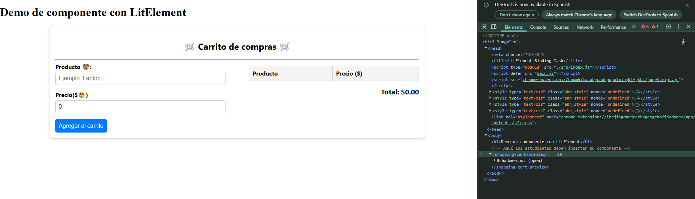
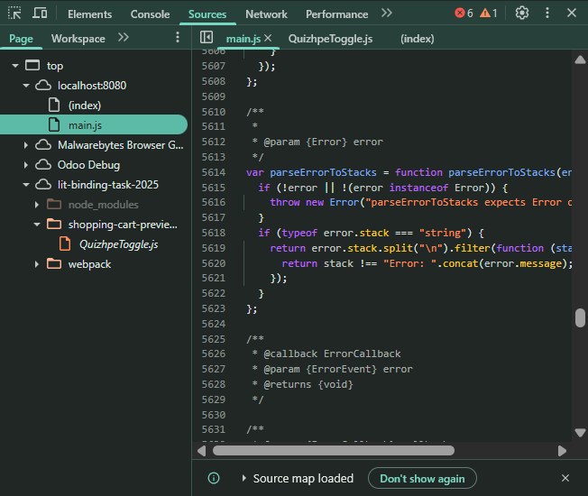
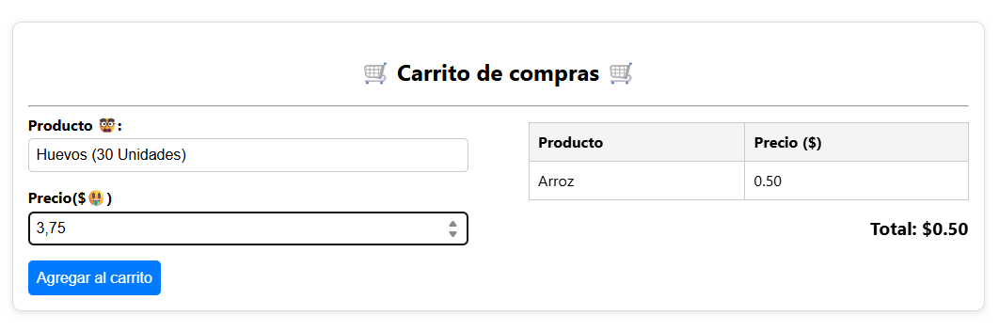
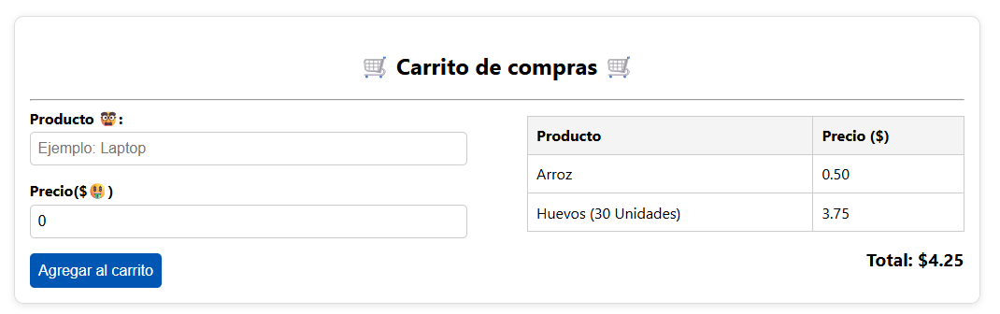

# 🏍️ Componente Web: `<shopping-cart-preview>`
**Nombre:** Alexander Miguel Quizhpe Cuzme\
**Carrera:** Tecnologías de la Información\
**Materia:** Programación Integrativa de Componentes

## 🎯 Objetivo

Este componente permite a los usuarios agregar productos con nombre y precio a un carrito virtual, mostrando en tiempo real un resumen tipo factura. Se ha desarrollado utilizando LitElement y aplica el concepto de **data binding reactivo** entre las propiedades del componente y el DOM.

---

## 🧠 Explicación técnica

### 🔁 Data Binding

Este componente implementa binding bidireccional entre las siguientes propiedades:

- `productName`: Nombre del producto ingresado.
- `productPrice`: Precio del producto ingresado.
- `cart`: Arreglo reactivo que contiene todos los productos añadidos.

#### Uso de decoradores:
Los decoradores permiten definir propiedades reactivas que automáticamente actualizan el DOM cuando cambian. Aunque se puede usar la sintaxis @property (con TypeScript), en JavaScript se usa la función static get properties(). Permitiendo vincular valores internos del componente con elementos del DOM para que el contenido se actualice en tiempo real sin recargar la página.

```js
static get properties() {
  return {
    productName: { type: String },
    productPrice: { type: Number },
    cart: { type: Array }
  };
}
```

#### Renderizado dinámico:

El método `render()` actualiza automáticamente la interfaz cuando una propiedad cambia:

```js
render() {
  const total = this.cart.reduce((sum, item) => sum + item.price, 0).toFixed(2);
  return html`
    ...
    ${this.cart.map(item => html`
      <tr>
        <td>${item.name}</td>
        <td>${item.price.toFixed(2)}</td>
      </tr>
    `)}
    ...
  `;
}
```

#### Eventos:
Los eventos permiten capturar acciones del usuario como escribir en un input o hacer clic en un botón, y reaccionar a ellos ejecutando lógica definida en funciones del componente. Es decir, que sirven para interactuar con el usuario: capturar datos, validar entradas, ejecutar funciones, etc.

```js
@input="${e => this.productName = e.target.value}"
@click="${this.addProduct}"
```

---

## 🛠️ Pasos de instalación y ejecución

### 1. Clonar el repositorio

```bash
git clone -b develop https://github.com/paulosk8/lit-binding-task-2025.git
cd lit-binding-task-2025
git checkout -b feature/shopping-cart-preview
```

### 2. Instalar dependencias
Las dependencias empleadas estan especificadas en el archivo ```package.json``` 
```bash
npm install
```

### 3. Ejecutar en modo desarrollo

```bash
npx webpack serve
```

> Asegúrate de tener instalado Node.js y Webpack.

---

## 📸 Capturas de pantalla del funcionamiento
Renderizado del componente observado desde la DevTools


Analisis a profundidad de la carga del elemento desde la DevTools


Ejecución del elemento creado


Ejecucion adiconal del elemento creado


---

## 🧻 Errores comunes enfrentados y soluciones

| Error                           | Solución                                                                                                  |
| ------------------------------- | --------------------------------------------------------------------------------------------------------- |
| `Can't resolve 'index.js'`      | Se corrigió el `entry` en `webpack.config.js` a `./index.js` para que sea relativo.                       |
| `require is not defined`        | Se configuró correctamente el entorno con Webpack CommonJS.                                               |
| No se mostraban datos en el DOM | Se usó correctamente `.value` y eventos `@input` para establecer el binding de propiedades.               |
| Estilos desordenados            | Se reorganizó la vista en dos secciones (`form` a la izquierda y `resumen` a la derecha) con CSS Flexbox. |

---